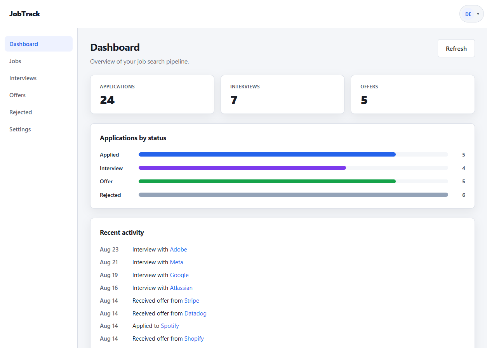
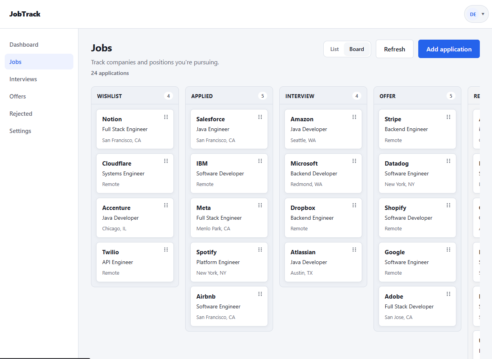
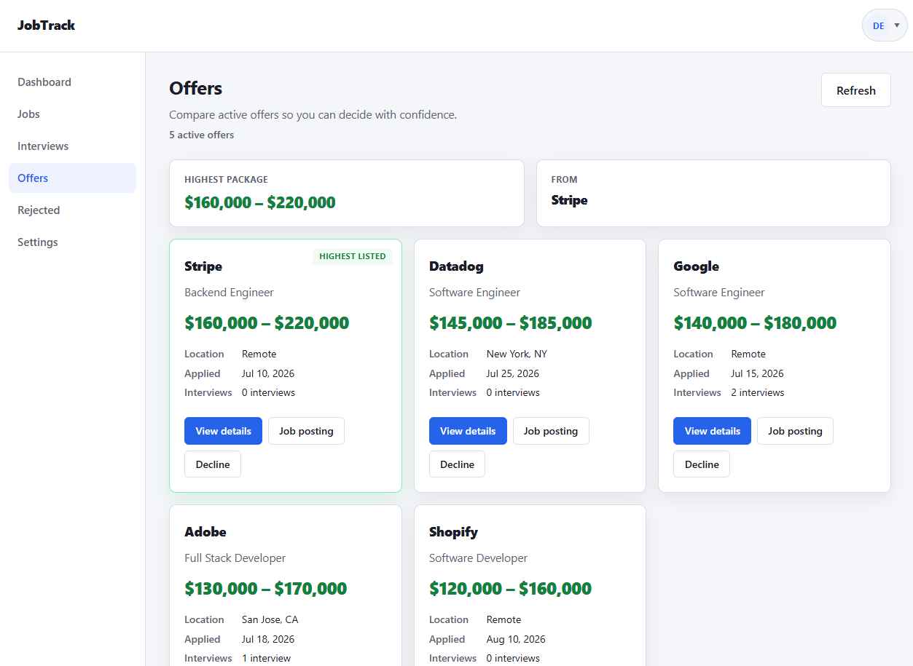
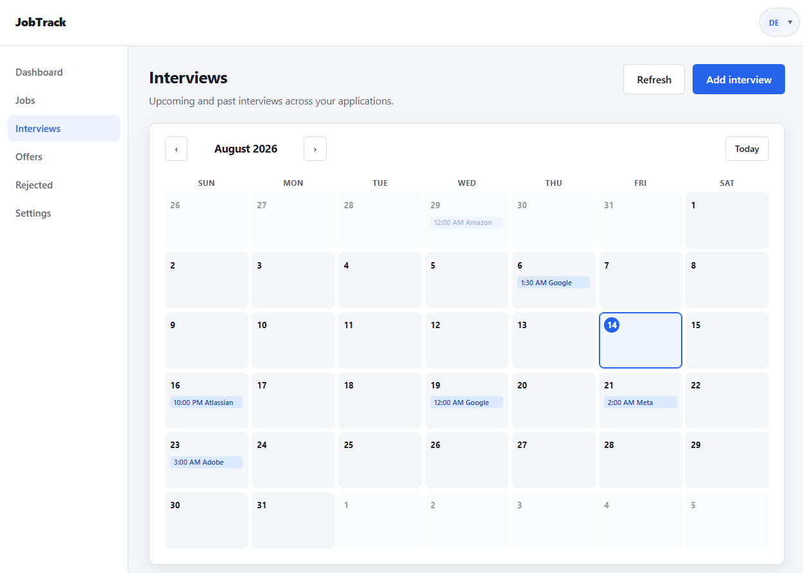
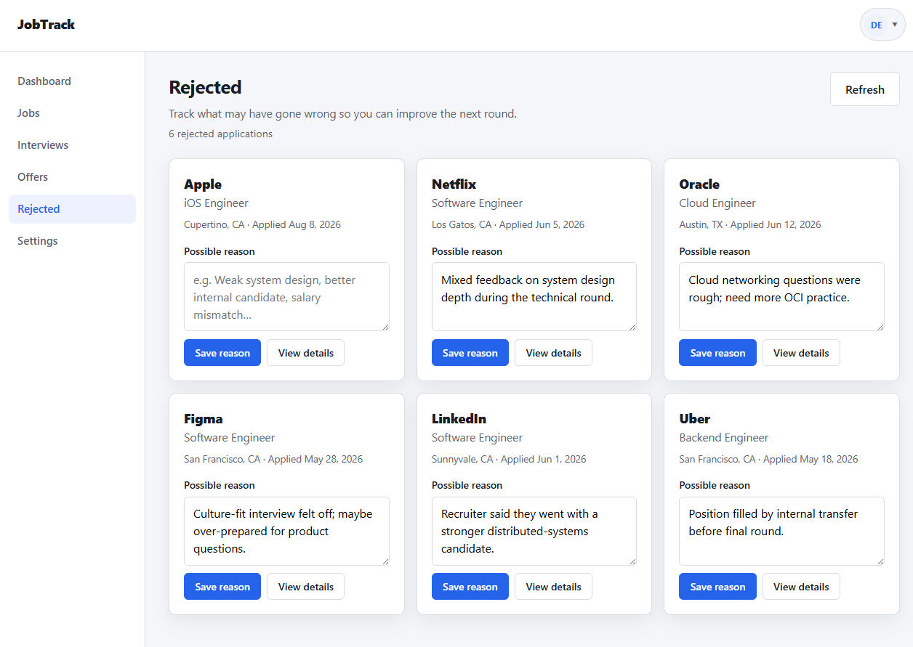

# JobTrack

Full-stack job application tracker — manage applications, interviews, contacts, and notes from a dashboard and Kanban board.

**Live demo:** [jobtrack-10841.web.app](https://jobtrack-10841.web.app)  
**Portfolio:** [jestleyportfolio.web.app](https://jestleyportfolio.web.app/)  
**Author:** [Jestley Charles Estipona](https://github.com/jestleycharles) · [GitHub repo](https://github.com/jestley-charles/jobtrack)



---

## Try the demo

Use the shared demo account to explore the app without signing up:

| Field | Value |
|---|---|
| **Email** | `demo@jobtrack.com` |
| **Password** | `jobtrackdemoaccount` |

1. Open the [live demo](https://jobtrack-10841.web.app/login.html).
2. Sign in with the credentials above.
3. Browse the **Dashboard**, **Jobs** (list + Kanban board), **Interviews**, **Offers**, and **Rejected** views.

The demo account is pre-seeded with sample applications, interviews, and contacts. Password changes and account deletion are disabled for this account.

To seed or refresh demo data on your own Supabase project, see [`docs/DEMO_SEED.md`](docs/DEMO_SEED.md).

---

## Features

- **Authentication** — email/password sign-up and login via Supabase Auth
- **Applications** — CRUD with status, salary range, location, job URL, and notes
- **Kanban board** — drag-and-drop status updates with touch support on mobile
- **Interviews** — schedule and track rounds with a calendar view and briefing modal
- **Dashboard** — pipeline stats, status chart, and recent activity feed
- **Offers & rejected** — dedicated views for late-stage outcomes and rejection reasons
- **Settings** — default jobs view preference, password change, account deletion

---

## Tech stack

| Layer | Technologies |
|---|---|
| **Frontend** | HTML, CSS, vanilla JavaScript |
| **Backend** | Java 21, Spring Boot 4, Spring Data JPA, Flyway |
| **Database** | PostgreSQL (Supabase) |
| **Auth** | Supabase Auth (JWT validated by Spring Boot) |
| **Hosting** | Firebase Hosting (frontend), Render (backend, Docker) |
| **Tooling** | Maven, Git, GitHub |

### Development tools

This project was built with **[Cursor](https://cursor.com)** — an AI-assisted IDE used for implementation, refactoring, and documentation across the codebase. Cursor agents follow shared project rules in [`docs/AI_AGENT_RULES.md`](docs/AI_AGENT_RULES.md) to keep multi-session development consistent.

---

## Project structure

```text
jobtrack/
├── frontend/           Static HTML/CSS/JS (Firebase Hosting)
├── jobtrack-backend/   Spring Boot REST API (Render)
├── docs/               Setup guides, demo seed, agent rules
├── screenshots/        UI captures for README / portfolio
└── render.yaml         Backend deploy config
```

---

## Running locally

You need a Supabase project (Postgres + Auth), a running backend, and a configured frontend.

### Backend

```bash
cd jobtrack-backend
# Configure env vars — see jobtrack-backend/.env.example and docs/SUPABASE_SETUP.md
./mvnw spring-boot:run
```

API runs at `http://localhost:8080` by default. Health check: `GET /api/health`.

### Frontend

```bash
cd frontend
copy .env.example .env          # fill in Supabase URL, anon key, API URL
npm run config                  # generates js/config.js from .env
# Serve frontend/ with any static server, e.g. npx serve .
```

Open `login.html` (or `index.html` for the landing page).

### Further setup

| Topic | Doc |
|---|---|
| Supabase (DB + Auth) | [`docs/SUPABASE_SETUP.md`](docs/SUPABASE_SETUP.md) |
| Firebase Hosting | [`docs/FIREBASE_SETUP.md`](docs/FIREBASE_SETUP.md) |
| Render backend | [`docs/RENDER_SETUP.md`](docs/RENDER_SETUP.md) |
| Demo account seed | [`docs/DEMO_SEED.md`](docs/DEMO_SEED.md) |

---

## Screenshots

| Dashboard | Jobs (Kanban) | Offers |
|---|---|---|
|  |  |  |

| Interviews | Rejected |
|---|---|
|  |  |

---

## Support

If JobTrack helped you or you'd like to support continued work on it:

**[Buy me a coffee on Ko-fi](https://ko-fi.com/jestleycharles)**

---

## License

This project is open source for portfolio and learning purposes. See the repository for usage terms.

Built by **[Jestley Charles Estipona](https://jestleyportfolio.web.app/)**.
